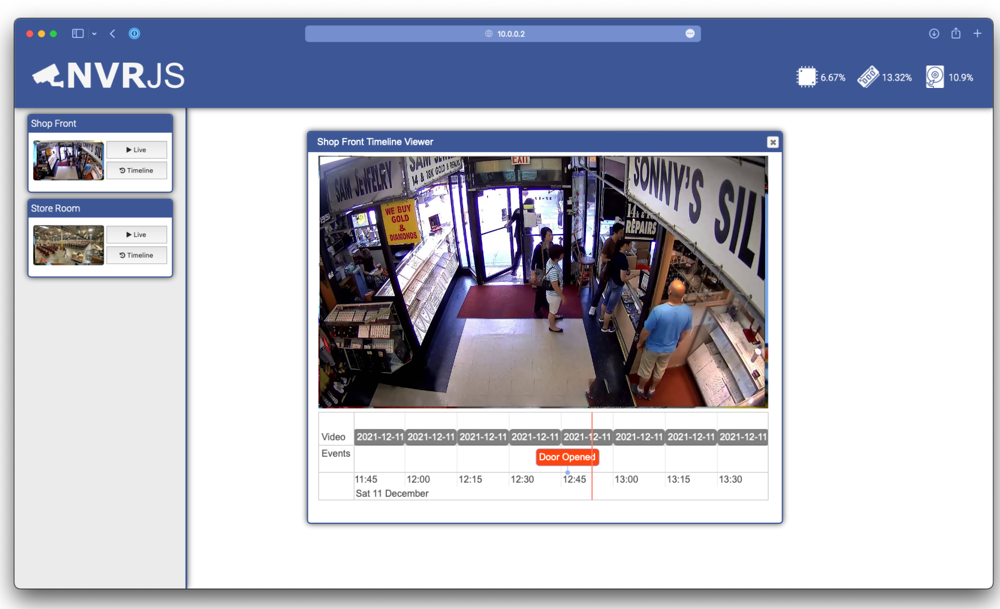

  

# nvr-js

NVR JS is a simple, very lightweight and efficient CCTV NVR based on Node JS.
its primarily aimd for 24/7 recording and live viewing.

Under the hood it uses ffmpeg, node js and websockets, all wrapped in a web based user interface.
The NVR has an API that allows to create events and timestamp them on the 24/7 recordings.

The 24/7 recordings can be reviewed using a timeline UI where the events are also time aligned on that same timeline.

 

### Inspired by shinobi.video
[Shinobi](https://shinobi.video) is a fully featured, jam packed NVR, also built using Node JS.
I was using Shinobi and thought it was amazing! - however it had sooo much to it, it was too overkill for my needs.

You can look at NVR-JS as a very slimed down version of shinobi video, built from the ground up.
the table below, shows how slimmed down it is.

| Feature           | Shinobi | NVR JS              |
|-------------------|---------|---------------------|
| Motion Dectection | &check; |                     |
| Object Detection  | &check; |                     |
| 24/7 Recording    | &check; | &check;             |
| Event Creation    | &check; | &check; (API Only)  |
| Notifications     | &check; |                     |
| Live Streaming    | &check; | &check; (Websocket) |
| Configuration UI  | &check; | Manual Editing      |
| Mobile Support    | &check; |                     |

As you can see, NVR JS does not pack the same features as Shinobi Video, but that's the intention.
NVR JS is designed for 24/7 recording with access to live footage, and the 24/7 recordings.

### The Event API.
To create events one only needs to send the following JSON payload.

The view here, is that you create events from various sensors in your setup, this effectively acts as your motion detector
or some other key event - It really up to you. 

{
     "name": "Motion Detected" | "Door Opened" | "Some Other Event" | "Of Your Choice",
     "sensorId": "HUEN849",
     "date": 1636194611
}

You **POST** this payload to the API as follows.
http://IP:7878/event/{system-password}/{camera-id}
